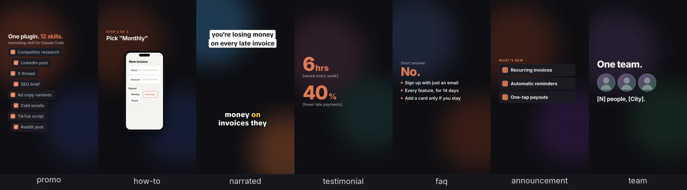
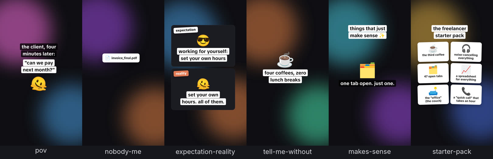
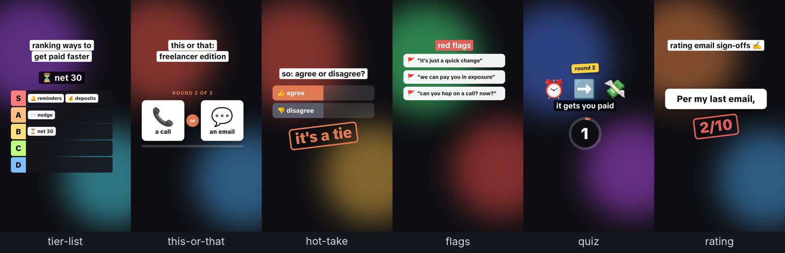
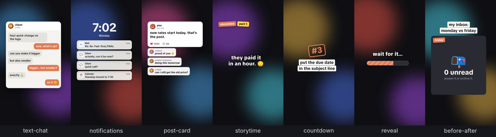

# Marketing Skills for Claude Code

**12 AI marketing skills in one Claude Code plugin:** competitor research,
social media content calendars, LinkedIn and X posts, SEO content briefs,
ad copy, email sequences, personalized cold email outreach, TikTok / Reels /
YouTube Shorts scripts, Reddit and Hacker News posts, and approval-gated
publishing to n8n, Make, or platform APIs.

[](LICENSE)
[](#install)
[](skills/)

```
claude plugin marketplace add marcosmodly/marketing-skill
claude plugin install marketing-skill@marketing-skill
```

Every skill is a standard `SKILL.md` in [`skills/`](skills/), shares one
brand-voice config, and works on its own or chained together. Nothing
posts or sends without your explicit approval. Using OpenAI Codex? See
[Using with Codex](#using-with-codex).

If it saves you time, a star on the repo helps other people find it.
Made something with it? [Share it in Show and tell](https://github.com/marcosmodly/marketing-skill/discussions/categories/show-and-tell).

## See it

29 video templates, rendered on your machine with music composed in your
brand's own sound. Each frame below is one template, mid-video:

**Marketing videos** (ads, demos, narrated explainers, testimonials, FAQs, launches, team)



**Everyday posts**: meme captions, comment bait, skits, and stories





[The plugin's own explainer](media/explainer/marketing-skill-explainer.mp4)
was made with the same renderer.

## What you can do with it

- **Competitor analysis:** research a rival and get a SWOT, messaging
  breakdown, and sales battlecard with cited sources.
- **Social media content calendar:** batch-write a week or month of dated
  posts for LinkedIn, Twitter/X, newsletters, Reddit, and short-form
  video, without repeating recent topics.
- **Content repurposing:** turn one blog post or announcement into a
  LinkedIn post, an X thread, and a newsletter blurb.
- **SEO content briefs:** target keyword, search intent, related keywords,
  outline, and meta title and description, with no made-up search volumes.
- **Ad copy:** A/B-testable variants for Facebook and Instagram (Meta),
  Google Search (RSA), and LinkedIn Ads, sized to each platform's limits.
- **Email marketing:** drip, nurture, and welcome sequences with timing,
  subject lines, and preview text.
- **Cold email outreach:** a daily batch of researched, 1:1 personalized
  prospecting emails, deduplicated against a permanent contact log that
  syncs replies, bounces, and unsubscribes from Gmail.
- **Short-form video:** hook-first scripts plus caption, hashtags, and
  best time to post for TikTok, Instagram Reels, and YouTube Shorts,
  shaped to the right type of marketing video (how-to, testimonial,
  launch, FAQ, and more) or to an everyday FYP format (POV, tier list,
  text-message skit, storytime, hot take, and 17 more). Also the finished
  vertical video itself, rendered on your machine: animated text over
  stock or AI backgrounds, with music composed in your brand's own sound
  and meme sound effects.
- **Community posts:** Reddit, Product Hunt, Hacker News (Show HN), Indie
  Hackers, dev.to, Discord, Slack, and Telegram posts written to each
  community's actual rules, with a Go/No-Go before drafting.
- **Visual briefs:** shot lists, per-scene image/video prompts, and aspect
  ratios for any AI image or video generator.
- **Publishing:** hand finished content to n8n, Make, or any webhook, or
  post directly to LinkedIn, X, Facebook, Reddit, Discord, Slack,
  Telegram, dev.to, YouTube, Instagram, or TikTok with your own API
  credentials.

**[See a full worked run →](EXAMPLE.md)** — one continuous
`full-pipeline` call from research to the approval checkpoint before
anything actually publishes.

## Skills

| Skill | Triggers on | Does |
|---|---|---|
| `competitor-research` | "research a competitor," "analyze a rival," "build a battlecard" | Full analytical competitor brief: overview, recent moves, messaging analysis, SWOT, recommendations, sources |
| `content-calendar` | "content calendar," "a week of posts," "plan a month of content" | Batch-generates several dated, platform-tagged posts in one pass, checked against `state/content-calendar.md` so it doesn't repeat a recent topic; queues everything for approval, never sends |
| `content-repurposer` | "repurpose this," "turn this into a LinkedIn post/thread/newsletter" | One source → a LinkedIn post, a Twitter/X thread, and a newsletter blurb, in one pass |
| `seo-brief` | "SEO brief," "keyword research," "optimize this for search" | Target/secondary keywords, search intent, suggested outline, meta title/description — never fabricates search-volume numbers |
| `ad-copy-generator` | "ad copy," "Meta/Google/LinkedIn ad variants," "A/B test copy" | Multiple ad variants per platform, each a distinct hook angle, sized to that platform's character limits |
| `email-sequence` | "email sequence," "drip campaign," "welcome series" | A multi-email sequence with send timing, subject lines, and a real narrative arc across emails |
| `email-outreach` | "cold outreach," "prospecting emails," "daily sales outreach," "personalized cold email to [name]" | Researches real prospects against a defined ICP (public-web research by default; a connected prospecting tool only if you ask for verified contact details), checks each one against a permanent contact log so nobody's contacted twice — or ever again once unsubscribed/replied — drafts a genuinely personalized email per prospect, re-confirms strategy monthly, and queues everything for approval (or drafts directly in Gmail if connected); never sends |
| `visual-brief-generator` | "visual brief," "video brief," "shot list," "image prompts for X" | A structured shot list, per-scene prompts, aspect ratios, and style guide; generates the actual asset only if a visual-gen tool is connected |
| `short-form-video` | "TikTok video," "Instagram Reel script," "YouTube Short," "short-form/vertical video for..." | A hook-first script/shot list plus a ready-to-post package per platform (YouTube Shorts/Instagram Reels/TikTok) — title/caption, sized hashtags, and a best-time-to-post window, shaped to one of 23 marketing video types (testimonial, how-to, announcement, and so on) or 22 everyday FYP formats (POV, tier list, text-message skit, storytime, and so on); if you opt in, makes the actual video too, either with a connected tool (Higgsfield, Figma Weave, Canva, or similar) or by rendering it locally (`scripts/video/`): animated text over stock or AI backgrounds, with music in the project's own saved sound; otherwise points to current free tools |
| `community-post-generator` | "post this to r/[subreddit]," "help me post on Product Hunt," "write a Show HN/Show IH for this," "post this on dev.to," "post this in our Discord/Slack/Telegram" | Live-researches that specific subreddit's, Product Hunt's, Hacker News's, Indie Hackers', dev.to's, or a public Telegram channel's/group's actual rules and typical post style first (verifying each source is actually about that target, not a similarly-named one); for Discord, Slack, and private Telegram targets, asks you for the rules instead, since it can't research those. Gives a plain Go/No-Go either way, and only drafts a post (shaped for that platform — title+body, title+URL+first comment for Show HN, dev.to's title+body+tags, or a single chat message in Discord's, Slack's, or Telegram's own formatting for the chat platforms) if it's actually welcome there, written to read like a person wrote it |
| `publish-pipeline` | "publish this," "send to n8n/Make," "fire the webhook," "send the queued post for [date]" | Packages finished content/assets into JSON and hands off to your automation via webhook (or, optionally, straight to a platform API) after showing you the exact payload |
| `full-pipeline` | "run the full pipeline," "research X and publish it," "do the whole thing end to end" | Chains research, repurposing, visual brief, and publish into one run, with a mandatory pause before anything actually publishes |

Plus one setup command: `/marketing-skill:marketing-setup`.

## Using your own project as source material

`competitor-research`, `content-calendar`, `content-repurposer`,
`seo-brief`, `ad-copy-generator`, `email-sequence`, `email-outreach`,
`visual-brief-generator`, `short-form-video`, and `community-post-generator`
can pull from the project they're installed in instead of requiring you to
paste content every time. If you reference
"our product," "our feature," "our changelog," etc. without providing the
text, they'll check `README*`, `CHANGELOG*`, `docs/**/*.md`, and
`package.json`/`pyproject.toml` at the project root first, and ask you
directly only if nothing relevant turns up. They only read
documentation-oriented files this way — never arbitrary source code — so
install this in your product's own repo to get the most out of it.

## Install

**Plugin method (recommended):**

```
claude plugin marketplace add marcosmodly/marketing-skill
claude plugin install marketing-skill@marketing-skill
```

This works once the plugin's branch is merged to the repo's default
branch, since `marketplace add` tracks a repo's default branch. To try it
before merging (e.g. against a feature branch), clone the repo locally and
point at your checkout instead — this is verified to work regardless of
which branch is checked out:

```
git clone https://github.com/marcosmodly/marketing-skill.git
cd marketing-skill && git checkout <branch-name>   # if not already on it
claude plugin marketplace add ./
claude plugin install marketing-skill@marketing-skill
```

**Manual fallback:** no confirmed minimum Claude Code version exists for
the plugin system — if `claude plugin` isn't available on your install
(check with `claude plugin --help`), copy the skills in by hand instead:

```
cp -r skills/* ~/.claude/skills/        # personal, all projects
# or
cp -r skills/* /your/project/.claude/skills/   # project-scoped
```

The manual copy skips the setup command (see "Configure" below for the
equivalent manual step) and `${CLAUDE_PLUGIN_ROOT}` path substitution.
Copied skills can't find `references/`, `state/`, or `scripts/` on their
own, so set `CLAUDE_PLUGIN_ROOT` to your clone of this repo before
starting Claude Code (`export CLAUDE_PLUGIN_ROOT=/path/to/marketing-skill`);
otherwise each skill asks you where the plugin lives.

## Using with Codex

OpenAI's Codex reads Claude Code's plugin files (`.claude-plugin/`), so
the same repo installs there too:

```
codex plugin marketplace add marcosmodly/marketing-skill
codex plugin add marketing-skill@marketing-skill
```

To try a branch, add `--ref <branch-name>` to the first command, or pass
the path to a local clone instead of `marcosmodly/marketing-skill`.

All 12 skills load as-is; Codex ignores the `allowed-tools` line. A few
things differ from Claude Code:

- **Setup command:** Codex turns `/marketing-skill:marketing-setup` into
  a skill, so ask Codex to "run the marketing setup" instead of typing
  the slash command. Codex only converts commands under 4 KB, so keep
  `commands/marketing-setup.md` short when editing it.
- **Plugin folder:** Codex doesn't fill in `${CLAUDE_PLUGIN_ROOT}`. Each
  skill works out the plugin folder itself (from the `CLAUDE_PLUGIN_ROOT`
  environment variable, or by finding the folder that holds
  `references/brand-voice.md`). Setting the variable is the reliable
  option, and it keeps your brand voice and queued posts in a folder you
  control rather than in Codex's installed copy:

  ```
  export CLAUDE_PLUGIN_ROOT=/path/to/marketing-skill   # your clone
  codex
  ```
- **Sandbox:** in its usual `workspace-write` mode, Codex only writes
  inside the folder you started it in and blocks network access from
  shell commands. If the plugin folder is somewhere else, add it to
  `writable_roots` (or approve the writes when asked). Publishing
  (`publish_webhook.py`, `publish_direct.py`) needs network access. Both
  settings go in `~/.codex/config.toml`:

  ```toml
  [sandbox_workspace_write]
  writable_roots = ["/path/to/marketing-skill"]
  network_access = true
  ```
- **Live research:** `competitor-research`, `seo-brief`,
  `community-post-generator`, `content-calendar`, `email-outreach`,
  `short-form-video`, and `full-pipeline` research the web as they run.
  Set `web_search = "live"` in `~/.codex/config.toml` so results are
  current rather than cached.
- **Connected tools:** Gmail drafts, prospecting tools, and video tools
  (Higgsfield, Figma Weave, Canva) work once the matching MCP server is
  set up in Codex. Without one, each skill falls back the same way it
  does in Claude Code.

## Configure

Every skill reads `references/brand-voice.md` before producing output —
your task priority, content types (short-form video, long-form video,
text posts, email, images), target audience, tone, output format, banned
words, and formatting constraints, defined once and reused everywhere.

- **Guided setup:** run `/marketing-skill:marketing-setup` any time
  (first-run or to update your answers).
- **Automatic:** if you skip setup, the first skill you actually use will
  ask the same 4 questions itself before proceeding, and save your answers
  for next time.
- **Manual:** edit `references/brand-voice.md` directly — keep its
  section headings intact so every skill can still find them.

`email-outreach` additionally reads its own
`references/outreach-strategy.md` — ICP/target segment(s), value
proposition and angle per segment, offer and primary CTA, daily volume,
follow-up cadence, and suppression window. It's configured the same way:
guided setup the first time `email-outreach` runs, or hand-edit directly.
Unlike `brand-voice.md`, it also re-opens itself automatically — the
skill checks its "last refreshed" date on every run and walks you through
a strategy-refresh conversation once 30 days have passed, using
`state/outreach-log.md`'s accumulated send/reply/bounce counts to inform
it.

## Making videos

`short-form-video` writes the script, captions, hashtags, and posting
times for TikTok, Reels, and Shorts, and, if you want, makes the video:

- **From a template:** 7 marketing types and 22 everyday formats (above),
  rewritten for your product and brand voice, over stock or AI
  backgrounds.
- **Narrated:** a script of numbered lines becomes a voiceover (a free
  local voice, or your own takes) over a background per line, with
  word-by-word captions synced to the voice (`compose.js`).
- **Your own footage:** a talking-head take from your phone gets its
  pauses cut and captions added (`cut.js`); screen recordings play in a
  phone frame.

Every video gets your **sonic identity** (one genre, key, and hook, so
your sound becomes recognizable) and **visual identity** (colors, font,
and a logo end card that lands with the sonic logo), the hook on screen
from the first frame, and a QA pass for text the platforms' buttons
would cover or that leaves too fast to read. Hook variants render
several openings to test, and a video log steers the next videos by how
yours actually did. Setup is free: Node, Playwright, and ffmpeg.

```
cd scripts/video && npm install
node compose.js script.md                    # a narrated video page from a script
node render.js page.html out.mp4 --cover 0   # the video, its captions (.srt), and its cover
```

Everything else, from backgrounds and sound to templates and connected
video tools: **[docs/video.md](docs/video.md)**.

## Content calendar & approval model

`content-calendar` batch-generates posts and queues them in
`state/content-calendar.md` — a plain Markdown table that's both the
forward calendar and the permanent send history (rows accumulate; nothing
gets cleared out). It's safe to hand-edit directly. The table itself is
just an index: each row's Notes column points at the file under
`state/posts/` that actually holds that post's full content —
`publish-pipeline` reads the file, not the table, when it sends.

The file enforces a separation of duties that every skill in this plugin
respects: **generation and approval are always two different steps.**
`content-calendar` (and anything else that drafts content) can only write
`Planned`, `Drafted`, or `Ready for Approval` to a row's Status — never
`Approved`. Only `publish-pipeline` writes `Approved`, and only
immediately after showing the real content to a human in a live
conversation and getting an actual reply back — silence, a timeout, or
the request having been phrased as blanket authorization ("just post
these") never counts as that reply. `publish-pipeline` then flips the row
to `Sent` right after a successful send.

When more than one row is ready at once, `publish-pipeline` lists them
together as a numbered batch (each with its Account/Destination/
Attachments/Final Text spelled out) instead of asking "send this?" one
row at a time — a reply has to name specific numbers to approve them,
since an unqualified "send them all" invites rubber-stamping a list
nobody actually read. It also flags any row more than 14 days old as
Stale right in that listing, and `content-calendar` separately reports
how many rows across the whole calendar have crossed that age every time
it runs — a queue that's easy to lose track of is exactly what turns a
careful approval step into a bulk-approved backlog later.

This matters most the moment you try to run this plugin unattended — see
"Running this on a schedule" below.

## Running this on a schedule

Nothing in this plugin runs on a timer by itself — a skill only executes
when a session invokes it. To get daily/weekly output, schedule the
*session*, not the plugin: Claude Cowork's scheduled tasks (or Claude
Code's own Routines/triggers) can fire a session on a cadence that runs
`content-calendar` or `full-pipeline`.

That solves "run it every day." It does **not** turn this into unattended
auto-posting, on purpose: `content-calendar` only ever queues rows as
`Drafted`/`Ready for Approval`, and `publish-pipeline` only sends a row
already `Approved` by an actual human reply in that conversation — a
scheduled trigger firing with nobody there to reply just leaves content
queued for you to review later, which is the intended behavior, not a
bug to work around. If you deliberately want unattended sending, you'd
need to change that approval step yourself — this plugin doesn't ship a
way to do that, on the theory that a live company account posting
unsupervised is a decision only you should make explicitly, not one a
scheduling tool should make for you by default.

`email-outreach` follows the exact same model, just applied to cold email
instead of social posts: schedule a daily session to get a consistent
daily batch (its own "consistent daily outreach" requirement), and it
queues every draft as `Drafted`/`Ready for Approval` — never `Sent` —
exactly like `content-calendar` does, for the same reason. Its monthly
strategy refresh doesn't need a separate schedule at all: the skill
checks `references/outreach-strategy.md`'s own last-refreshed date on
every run and walks through the refresh conversation itself once 30 days
have passed, so the one daily trigger alone covers both cadences.

## Publishing, community posts, and outreach

- **[Publishing](docs/publishing.md):** hand finished content to n8n,
  Make, or any webhook (`scripts/publish_webhook.py`), or post straight
  to LinkedIn, X, Facebook, Reddit, Discord, Slack, Telegram, dev.to,
  YouTube, Instagram, or TikTok with your own credentials
  (`scripts/publish_direct.py`). Both refuse to run without `--dry-run`
  or `--confirmed`. The page covers what each platform's access really
  takes, including TikTok's private-only rule until your app is audited.
- **[Community posts](docs/community-posting.md):** how
  `community-post-generator` researches each subreddit's, Product Hunt's,
  Hacker News's, Indie Hackers', dev.to's, or a Telegram channel's actual
  rules before drafting, and asks you for Discord's and Slack's.
- **[Cold outreach](docs/outreach.md):** the contact log that keeps
  anyone who replied, bounced, or unsubscribed from ever being emailed
  again, and how Gmail and prospecting tools plug in.

## FAQ

### What are Claude Code skills?

A skill is a folder with a `SKILL.md` file that teaches Claude a
repeatable task. Claude reads each skill's description and uses it
automatically when your request matches ("write an SEO brief for…",
"give me a week of LinkedIn posts"), or you can call one by name, such as
`/marketing-skill:seo-brief`.

### Do I need API keys or paid tools?

No. Research uses Claude's built-in web search and fetch, and every skill
produces its full written output with no connector or API key. Gmail, a
prospecting tool, Higgsfield, Canva, and platform API credentials are
optional extras, and paid ones are used only when you ask. Rendering a
video locally needs only free tools (Node, Playwright, and ffmpeg), plus
free Pexels and Pixabay keys if you want stock backgrounds.
Actually sending content needs your own webhook or credentials.

### Will it post or send emails automatically?

No. Drafts are queued in `state/`, and only `publish-pipeline` sends,
after you approve specific items in a live conversation.
`email-outreach` creates drafts and never sends. See
[Content calendar & approval model](#content-calendar--approval-model).

### Can I use just one skill?

Yes. Ask for what you need and only the matching skill runs. To skip the
plugin system, copy the skill folders in by hand (see [Install](#install)).

## Repo layout

```
.claude-plugin/
  plugin.json         # plugin metadata
  marketplace.json     # lets this repo install itself via `marketplace add` (Claude Code and Codex)
skills/                 # the 12 skills, one SKILL.md each
commands/
  marketing-setup.md    # the /marketing-skill:marketing-setup command
references/
  brand-voice.md         # shared config every skill reads (hand-edited)
  outreach-strategy.md   # email-outreach's own config: ICP, angle, offer, cadence (hand-edited or guided setup)
  video-types.md         # 23 marketing video types: goal, short-form beats, and how each gets made (hand-editable)
  sound-guide.md         # music genres, sound effects, how to pick a project's sonic identity, a hook library, licensed tracks
  hooks.md               # hook patterns by goal, written to work with the sound off, and how to test them
  video-rendering.md     # the local render procedure short-form-video follows
  fyp-formats.md         # 22 everyday / FYP formats: why each works, beats, copy at two tones, weekly mix and rotation
docs/                    # the longer guides: video, publishing, community posts, outreach, and the template gallery
state/
  content-calendar.md    # calendar/history index (generated + appended to, hand-editable)
  posts/                  # one file per queued post's full content, linked from the index above
  outreach-log.md         # outreach queue/history + permanent suppression list (generated + appended to, hand-editable)
  outreach/               # one file per drafted email's full content, linked from the log above
  video-log.md            # every posted video with its format, hook, and numbers; steers the next ones
scripts/
  publish_webhook.py     # stdlib-only webhook sender (see --help)
  publish_direct.py      # stdlib-only direct-to-platform scaffold (LinkedIn/X/Meta/Reddit/Discord/Slack/Telegram/dev.to/YouTube/Instagram/TikTok), needs your own API credentials (see --help)
  video/
    render.js            # animated HTML page -> vertical MP4 with an original soundtrack (needs Node, Playwright, ffmpeg)
    soundtrack.js        # the music and sound-effects synthesizer render.js uses (no dependencies)
    media.js             # finds stock photos and clips (Pexels, Pixabay, Openverse) and writes their credits
    check.js             # QA pass over templates: layout lint, cues, fonts, loudness, contact sheets
    voice.js             # free local voiceover (Kokoro): a script -> one WAV per line
    captions.js          # word timing for a voice line, caption chunks, and .srt files
    compose.js           # a narrated video page from a script: voice, backgrounds, synced captions
    brand.js             # applies the Visual Identity to a page: colors, font, logo end card
    cut.js               # a filmed talking-head take: pauses cut, captions, and a page to render it
    beats.js             # a music track's tempo, beats, bars, and drops, to cut a video on its beat
    gallery.js           # rebuilds the template gallery in docs/gallery
    templates/           # 7 marketing + 22 everyday starting pages, built from templates/build.py and fyp.py
```

## Share what you made

Made a content calendar, a cold email batch, a video, or a launch post
with these skills? Post it in
[Show and tell](https://github.com/marcosmodly/marketing-skill/discussions/categories/show-and-tell),
along with which skills you ran and anything that didn't work the way you
expected. Questions go in
[Q&A](https://github.com/marcosmodly/marketing-skill/discussions/categories/q-a),
and bugs in [Issues](https://github.com/marcosmodly/marketing-skill/issues).

## Contributors

- [marcosmodly](https://github.com/marcosmodly)
